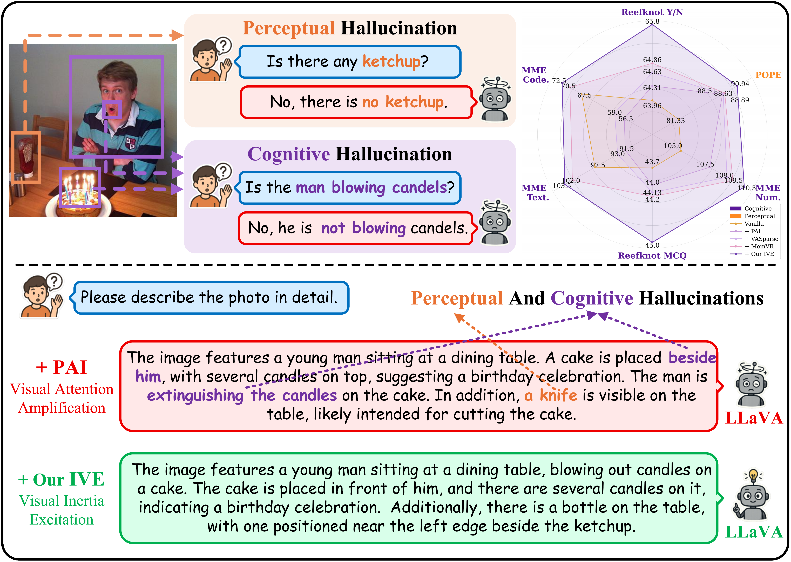

# Attention at Rest Stays at Rest: Breaking Visual Inertia for Cognitive Hallucination Mitigation


> [Boyang Gong](https://github.com/wfr429), [Yu Zheng](https://yzheng97.github.io/)$\dagger$, [Fanye Kong](https://scholar.google.com/scholar?q=Fanye+Kong), [Jie Zhou](https://www.au.tsinghua.edu.cn/info/1078/3126.htm), [Jiwen Lu](http://ivg.au.tsinghua.edu.cn/Jiwen_Lu/)  
$\dagger$ Project leader

<p align="center">Stay tuned — code release coming soon! 🚀</p>

Abstract: *Like a body at rest that stays at rest, we find that visual attention in multimodal large language models (MLLMs) exhibits pronounced inertia, remaining largely static once settled during early decoding steps and failing to support the compositional understanding required for cognitive inference. While existing hallucination mitigation methods mainly target perceptual hallucinations concerning object existence or attributes, they remain inadequate for such cognitive hallucinations that require inter-object relational deduction. Through token-wise attention analysis, we identify this visual inertia as a key factor: attention to semantically critical regions remains persistently focused and fails to dynamically support relational inference. We thereby propose a training-free Inertia-aware Visual Excitation (IVE) method that breaks this inertial pattern by modeling cognitive inference as the dynamic responsiveness of visual attention. Specifically, IVE selects visual tokens that are dynamically emerging relative to historical attention trends while distinguishing tokens exhibiting inertial behavior. To further facilitate compositional inference, IVE introduces an inertia-aware penalty that discourages over-concentration and limits the persistence of attention within localized regions. Extensive experiments show that IVE is effective across various base MLLMs and multiple hallucination benchmarks, particularly for cognitive hallucinations.*

<p align="center">
    
</p>


<!-- ## Acknowledgement -->


## BibTeX

```
@misc{gong2026attentionreststaysrest,
      title={Attention at Rest Stays at Rest: Breaking Visual Inertia for Cognitive Hallucination Mitigation}, 
      author={Boyang Gong and Yu Zheng and Fanye Kong and Jie Zhou and Jiwen Lu},
      year={2026},
      eprint={2604.01989},
      archivePrefix={arXiv},
      primaryClass={cs.CV},
      url={https://arxiv.org/abs/2604.01989}, 
}
```
